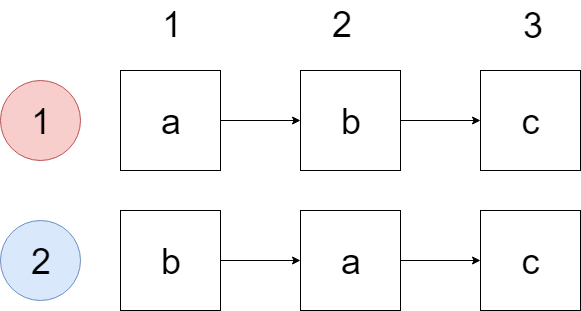

# きっとわかる bit DP

この記事は Competitive Programming (2) Advent Calendar 2018 17日目の記事として書かれたものです。

## はじめに

この記事は初歩的なbitDPの解説記事です。

「簡単な1次元DPならわかるけど、bitDP？むずかしそう」になっている方へ向けて書いています。

そのためもうbitDPを知っている方には何も得るものは無いと思います。ごめんなさい。

## 前提知識

- 簡単な動的計画法
- bitを用いた状態の表現の方法

## bitDPとは何か

「(集合の表現に)bit(を用いた集合に対する)DP」です。

もちろんこれだけでは何がなんだか分からないと思うので実際に問題を解いてみましょう。

## yukicoder #357 品物の並び替え (Middle)

<https://yukicoder.me/problems/no/357>

>### 問題文
>ここに0番〜(N-1)番の品物がある。
>
>また、
>
>item1 item2 score
>
>という形式で書かれた得点表がある。
>
>品物を並べた時、item1がitem2よりも前であればscore点を獲得できるという意味である。
>
>得点表が与えられるので、品物を適切に並び替えた時、獲得できる得点を最大化したい。そのときの得点を出力せよ。
>### 入力
>
> ```txt
> N M
>item1[1] item2[1] score[1]
> ...
>item1[M] item2[M] score[M]
> ```
>N:品物の数
>
>M:得点表の行数
>
>item1[i] item2[i] score[i] (1<=i<=M): 品物1、品物2、得点
>### 制約
>2<=N<=14
>
>1<=M<=N*(N-1)
>
>0<=item1,item2<N
>
>item1!=item2
>
>1<=score<=10000
>### 出力
>獲得できる最大得点を出力せよ。出力後は改行すること。

### 愚直解

愚直な解法に、「全ての品物の並べ方を全て列挙して、それぞれの並び方について得点を計算する」というものが考えられます。

この解法だと、1つの並べ方の得点を計算するのにO(M)、列挙する並べ方はN!通りあるので、全体の計算量はO(N! x M)、すなわちO(N! x N^2)となります。

今回の制約ではNは最大で14であり、この解法だと最大で約10^13回のステップとなります。

今回の実行制限時間は5秒、1秒間に実行できる処理はおよそ10^9回なので全く間に合いません。

### bit DP 解

bit DP の解説記事なので当然 bit DP を使って解きます。(はい)

今度はまず前から品物itemi, itemj(0<=i, j<=n - 1)の2つが順に置いてあって、その後ろにitem k(0<=k<=n-1)を置く時を考えます。



この時増える得点は得点表を全て参照して、item i item kもしくはitem j item kとなることで求められます。

ところで、品物item i, item jが逆順(すなわち前から item j, item iが置かれている)に置かれている時に増える得点はいくらでしょうか。

これは正順に品物が置かれている時と変わりません。なぜなら、item k を追加するときに増える得点は item k よりも前に置かれている品物が何かで決まり、前に置かれている品物の並び方は関係ないからです。

つまり今まで配置した品物の集合とその集合を得点が最大になるように配置した時の得点が分かれば、その集合に一つ品物を加えた時の得点がO(M)で求められます。

言い換えをすると、ある品物の集合Sを最適に配置した時の得点は集合Sから1つ要素を取り除いた集合S'の得点と取り除いた要素を追加した時の得点を計算することで求められます。

```cpp
dp[S] = max{dp[S \ {u}] + score[u] | u ∈ S \ {u}}
```

ということです。

取りうる集合は2^n - 1こ、それぞれの遷移にO(nm)かかるので計算量はO(NM x 2^n)です。

これで集合に対するDP部分の解説は終わりです。あとは集合を表現する方法を考えます。

品物0から品物n- 1について、その品物を使うか(使わないか)ということを表現できればよさそうです。

これをn桁の二進数を用いて表現します。二進数のi桁目を品物iを使っている⇒1使っていない⇒0という風に表現します。


https://yukicoder.me/submissions/305013

```cpp
#include <iostream>
#include <algorithm>
#include <vector>

using namespace std;

int main(){
	int n, m;
	cin >> n >> m;
	vector<int> item1(m), item2(m), score(m);
	for(int i = 0; i < m; ++i) cin >> item1[i] >> item2[i] >> score[i];

	vector<int> dp(1 << n, 0);
	for(int i = 0; i < (1 << n) - 1; ++i){ // 11....1110までループ
		for(int j = 0; j < n; ++j){
			if(i & (1 << j)) continue; // 品物jがすでに配置されている(集合iに含まれている)ならばスキップする
			int sum = 0; // 品物jを追加した時に増える得点
			for(int k = 0; k < m; ++k){
				if((i & (1 << item1[k])) && item2[k] == j){ // 品物item1[k]がすでに配置されていて、item2[k]が追加する品物(品物j)ならば得点を追加する
					sum += score[k];
				}
			}
			dp[i | (1 << j)] = max(dp[i | (1 << j)], dp[i] + sum);
		}
	}

	cout << dp[(1 << n) - 1] << endl;
}
```

